





<!--  -->

# Biography

I'm currently an associate professor at Zhejiang University of Technology.
Before that, I was a postdoctoral research fellow at [AML Lab](https://aml-cityu.github.io/) from City University of Hong Kong supervised by Prof. [Xiangyu Zhao](https://zhaoxyai.github.io/).
I obtained the PhD degree in data science from City University of Hong Kong (CityU) supervised by Prof. [Xiangyu Zhao](https://zhaoxyai.github.io/) and Prof. [Ding-Xuan Zhou](https://www.sydney.edu.au/science/about/our-people/academic-staff/dingxuan-zhou.html). 
I obtained the BSc and MSc degrees in computer science at Zhejiang University of Technology (ZJUT) supervised by Prof. [Guojiang Shen](https://homepage.zjut.edu.cn//sgj/) and Prof. [Xiangjie Kong](http://www.cssclab.cn/xjkong/).

My research interests include Large Language Models, Learning Theory, City Computing, and Recommender Systems.
If you are interested in collaborating with me or want to have a chat, always feel free to contact me through <a href="mailto:hahahenha@gmail.com">*hahahenha@gmail.com*</a>.

# News

<!--

-->

<ul>
    <li>[2025.09] One paper has been accepted by NeurIPS 2025. </li>
    <li>[2025.08] Two regular papers & one workshop paper have been accepted by CIKM 2025. </li>
    <li>[2025.06] Our tutorial about Spatio-Temporal Data Mining got accepted in SSTD 2025. </li>
    <li>[2025.06] One article is published on BOC Connect app (中銀商聚). </li>
    <li>[2025.05] Two papers have been accepted by KDD 2025.</li>
    <li>[2025.04] One paper has been accepted by IJCAI 2025.</li> 
    <li>[2024.12] One paper has been accepted by AAAI 2025.</li>
    <li>[2024.12] One paper has been accepted by WWW 2025 tutorial.</li>
    <li>[2024.07] One paper has been accepted by IEEE Transactions on Vehicular Technology.</li>
    <li>[2024.06] One paper has been accepted by KDD 2024, research track.</li>
    <li>[2023.05] One paper has been accepted by KDD 2023, research track.</li>
</ul>

# Selected Publications 

<ul>
  <li>
    <Strong>Xiao Han</Strong>, Zimo Zhao, Wanyu Wang, Maolin Wang, Zitao Liu, Yi Chang, and Xiangyu Zhao,
    Data Efficient Adaptation in Large Language Models via Continuous Low-Rank Fine-Tuning,
    <em>The Thirty-ninth Annual Conference on Neural Information Processing Systems (<Strong>NeurIPS</Strong>), 2025</em>.
    <a target="_blank" rel="noopener" href="https://arxiv.org/pdf/2509.18942?">[Paper]</a>
    <a target="_blank" rel="noopener" href="https://github.com/zzm-black/DEAL-Continuous-Low-Rank-Fine-Tuning">[Code]</a>
  </li>
  
  <li>
    <Strong>Xiao Han</Strong>, Chen Zhu, Xiangyu Zhao, and Hengshu Zhu,
    Swarm Intelligence in Geo-Localization: A Multi-Agent Large Vision-Language Model Collaborative Framework,
    <em>Thirty-first ACM SIGKDD Conference on Knowledge Discovery and Data Mining (<Strong>KDD</Strong>), Research Track,  2025</em>.
    <a target="_blank" rel="noopener" href="../Papers/KDD2025_smileGeo.pdf">[Paper]</a>
    <a target="_blank" rel="noopener" href="https://github.com/Applied-Machine-Learning-Lab/smileGeo">[Code]</a>
  </li>
  
  <li>
   <Strong>Xiao Han</Strong>, Zijian Zhang, Xiangyu Zhao, Guojiang Shen, Xiangjie Kong, Xuetao Wei, Liqiang Nie, Jieping Ye, and Yuanshao Zhu,
    GARLIC: GPT-Augmented Reinforcement Learning with Intelligent Control for Vehicle Dispatching,
    <em>Thirty-Nine AAAI Conference on Artificial Intelligence (<Strong>AAAI</Strong>), 2025</em>.
    (<Strong style="color: red;">Oral</Strong>)
    <a target="_blank" rel="noopener" href="https://arxiv.org/abs/2408.10286">[Paper]</a>
  </li>
  
  <li>
    <Strong>Xiao Han</Strong>, Dingxuan Zhou, Guojiang Shen, Xiangjie Kong, Yulong Zhao,
    Deep Trajectory Recovery Approach of Offline Vehicles in the Internet of Vehicles,
    <em>IEEE Transactions on Vehicular Technology, 2024</em>.
    <a target="_blank" rel="noopener" href="https://ieeexplore.ieee.org/document/10586793">[Paper]</a>
  </li>
  
  <li>
    <Strong>Xiao Han</Strong>, Chen Zhu, Xiao Hu, Chuan Qin, Xiangyu Zhao, and Hengshu Zhu,
    Adapting Job Recommendations to User Preference Drift with Behavioral-Semantic Fusion Learning,
    <em>The 30th ACM SIGKDD Conference on Knowledge Discovery and Data Mining (<Strong>KDD</Strong>), Research Track, 2024</em>.
    <a target="_blank" rel="noopener" href="https://arxiv.org/pdf/2407.00082">[Paper]</a>
  </li>
  
  <li>
    <Strong>Xiao Han</Strong>, Xiangyu Zhao, Liang Zhang, and Wanyu Wang,
    Mitigating action hysteresis in traffic signal control with traffic predictive reinforcement learning,
    <em>The 29th ACM SIGKDD Conference on Knowledge Discovery and Data Mining (<Strong>KDD</Strong>), Research Track, 2023</em>.
    <a target="_blank" rel="noopener" href="https://dl.acm.org/doi/abs/10.1145/3580305.3599528">[Paper]</a>
  </li>
  
  <li>
    <Strong>Xiao Han</Strong>, Guojiang Shen, Xi Yang, and Xiangjie Kong,
    Congestion Recognition for Hybrid Urban Road System via Digraph Convolutional Network,
    <em>Transportation Research Part C: Emerging Technologies, 2020</em>.
    <a target="_blank" rel="noopener" href="https://www.researchgate.net/profile/Xiangjie-Kong-2/publication/347696366_Congestion_recognition_for_hybrid_urban_road_systems_via_digraph_convolutional_network/links/617cef433c987366c30419d2/Congestion-recognition-for-hybrid-urban-road-systems-via-digraph-convolutional-network.pdf">[Paper]</a>
  </li>
</ul>

<!--
# Projects

  <ul>
    <li>
                            

                            <h2>Signal Timing: "City Brain" Project in Xiaoshan District, Hangzhou, Zhejiang Province</h2>
                            
Deploy adaptive-signal-control algorithm for all intersections with signal control in Xiaoshan District。

                            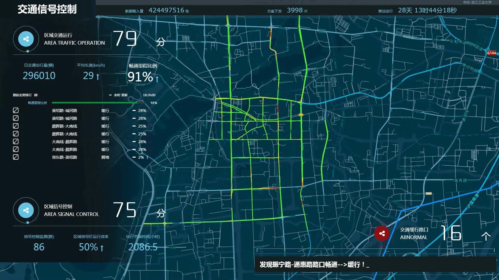
                            
The comparison between before (left) and after (right) deployment of the algorithm is as follows:

                            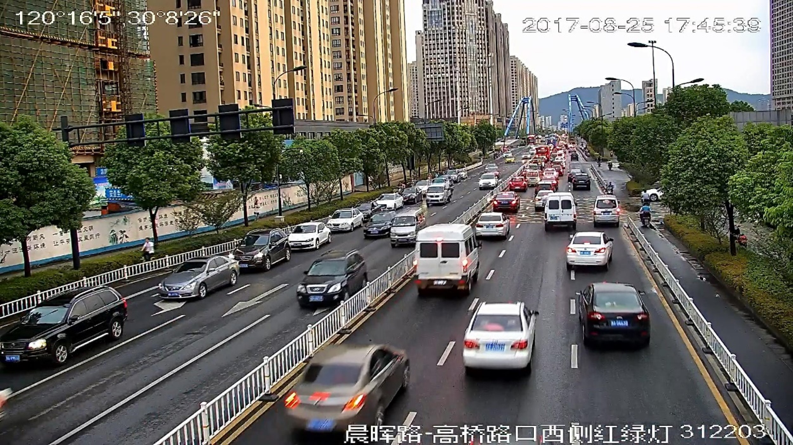
                            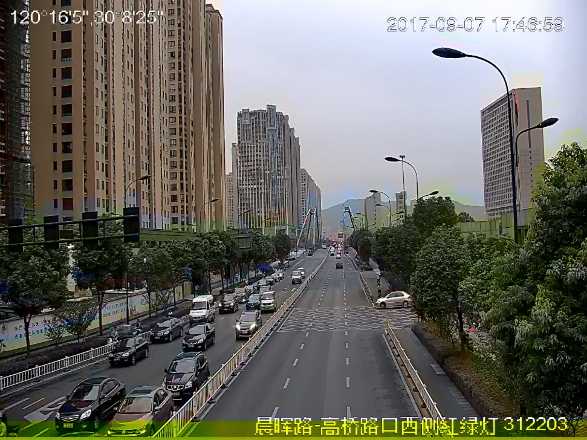
                        </li>
                        <li>
                            

                            <h2>Special Vehicles First System</h2>
                            
The project aims to open a emergency channel for special vehicles (e.g. ambulances).

                            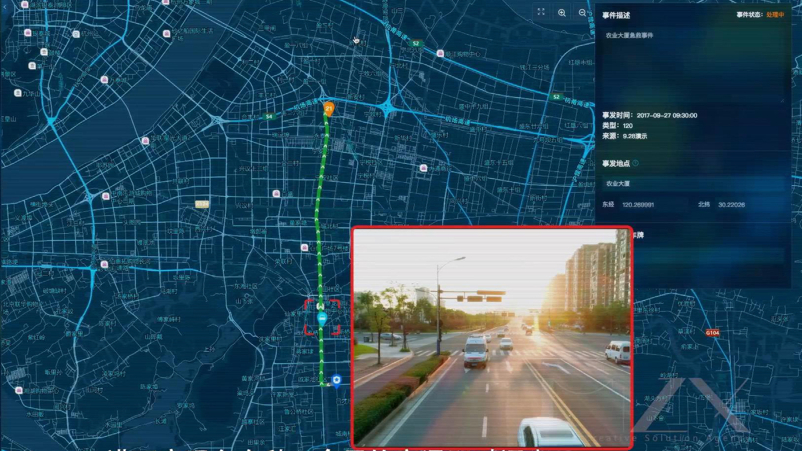
                            
When vehicles are going to pass through the intersection, the signal lights lock the green light in advance. It will release queued vehicles and ensure that the target vehicle does not stop at intersection and pass safely.

                            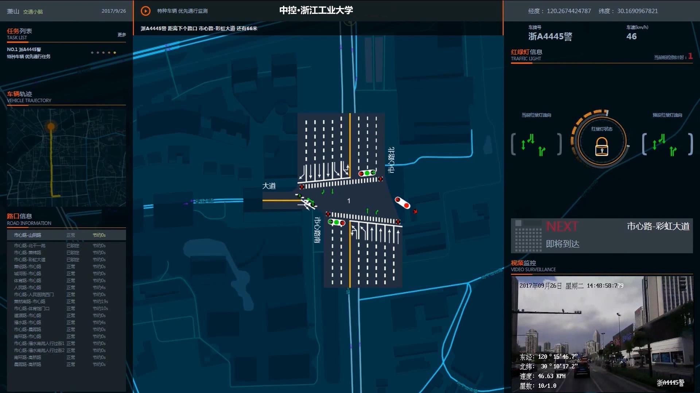
                            
When the vehicle passes by the intersection, the signal lights release the green light lock as soon as possible to avoid traffic jams in other directions

                            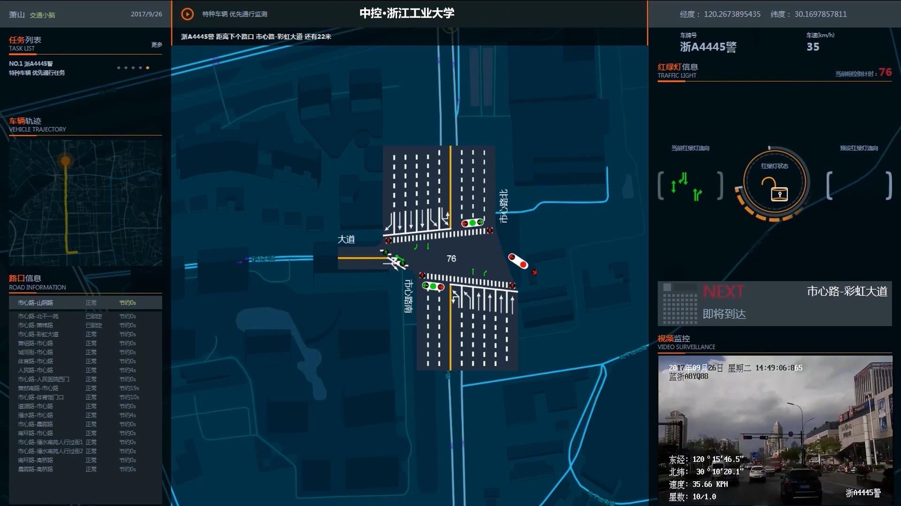
                        </li>
                        <li>
                            

                            <h2>The Display System in Hangzhou Transportation Administration of Zhejiang Province</h2>
                            
A comprehensive display system of data collected by various detectors in Hangzhou.

                            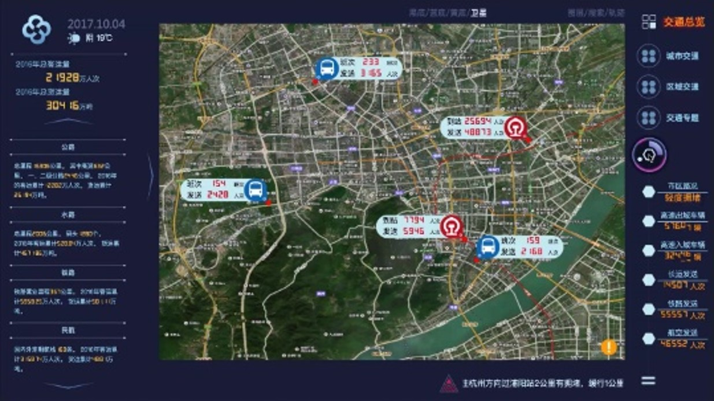
                            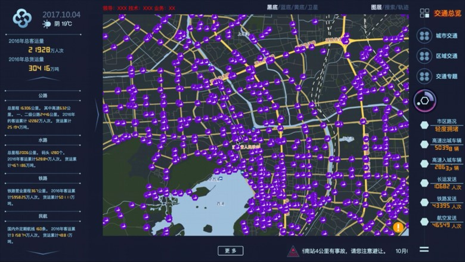
                            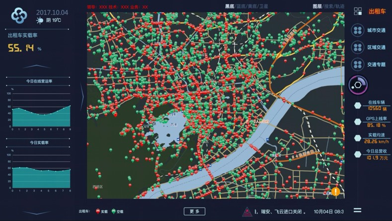
                            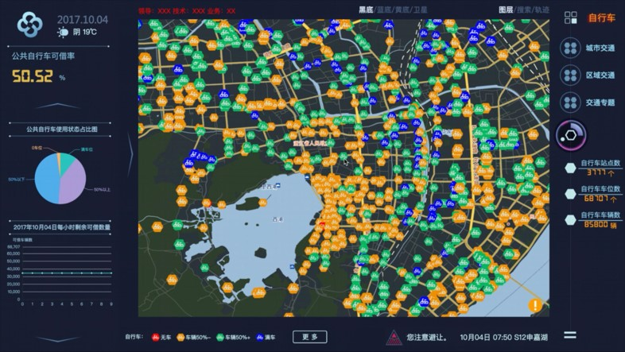
                            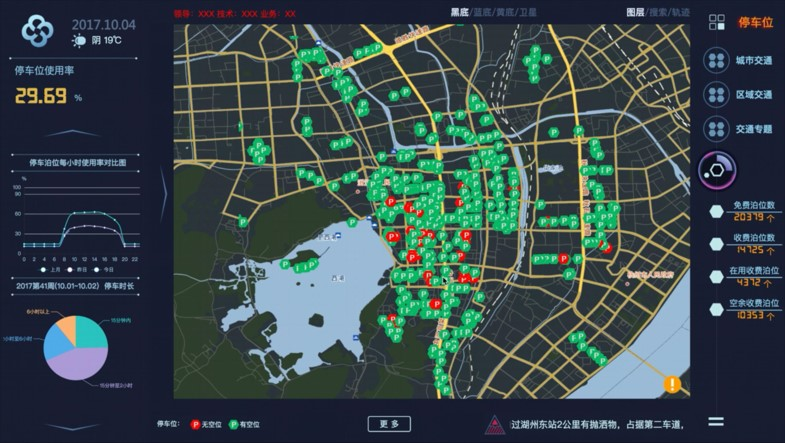
                            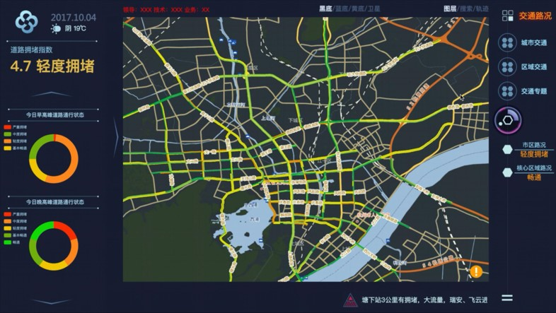
                        </li>
                        <li>
                            

                            <h2>Imitation of Unix file system
                                <a href="https://github.com/hahahenha/UnixFilesystem">
                                    <i nclass="icon-link"></i>Source Code</a>
                            </h2>
                            
A file system that simulates the underlying storage of Unix systems with basic file operations.

                        </li>
                         <li>
                            

                            <h2>Tea——A Web Design Project
                            	<a href="https://www.hahahenha.net/static/tea">
                                    <i nclass="icon-link"></i>Go to</a>
                            </h2>
                            
Design and complete a beautiful front-end website.

                        </li>
                        <li>
                            

                            <h2> OA System </h2>
                            
It is written in .NET language and integrates modules such as login, hierarchical notification, personal attendance, schedule, online meeting, workflow design and management, work plan, mail system, asset management, electronic seal management, contract record, system operation log, etc. It has greatly promoted the management of leaders at all levels, coordinated exchange of information between various departments, and the safe, stable and reliable transmission of information inside and outside the department, which facilitates the realization of distributed office and mobile office for all employees.

                        </li>
                        <li>
                            

                            <h2> Indoor Positioning APP </h2>
                            
The location of the target is accurately located through the signal strength of multiple wifi and Bluetooth beacons distributed indoors.

                            <iframe width="560" height="315" src="https://www.hahahenha.net/static/CV/video/project-5.mp4" frameborder="0" allow="accelerometer; clipboard-write; encrypted-media; gyroscope; picture-in-picture" allowfullscreen></iframe>
                        </li>
                        <li>
                            

                            <h2> Traffic Data-fusion System </h2>
                            
Combined with the distributed platform Spark, distributed file system HDFS, SpringBoot framework and D3.js front-end visual library are written and completed.

                            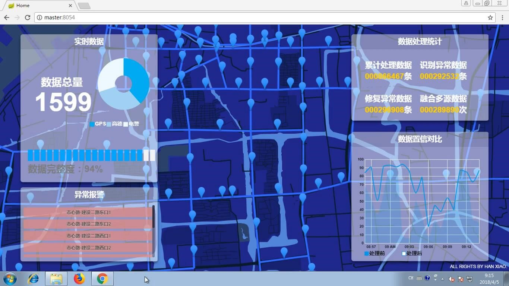
                        </li>
                        <li>
                            

                            <h2> Signal Timing Project of Jiujiang City, Jiangxi Province </h2>
                            
Timing the evening peak signal for the main road of Jiujiang City.

                        </li>
  </ul>

-->

